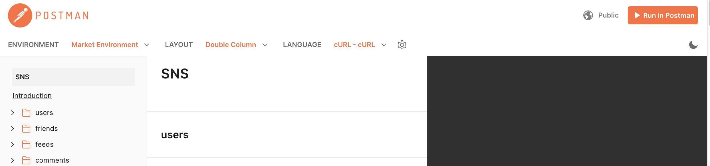
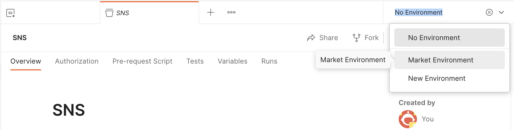
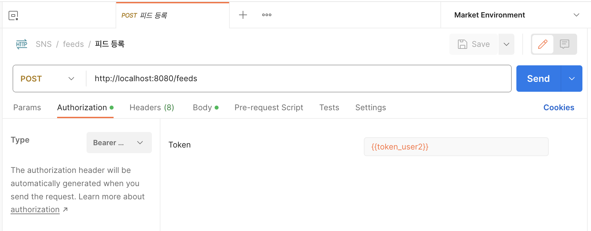
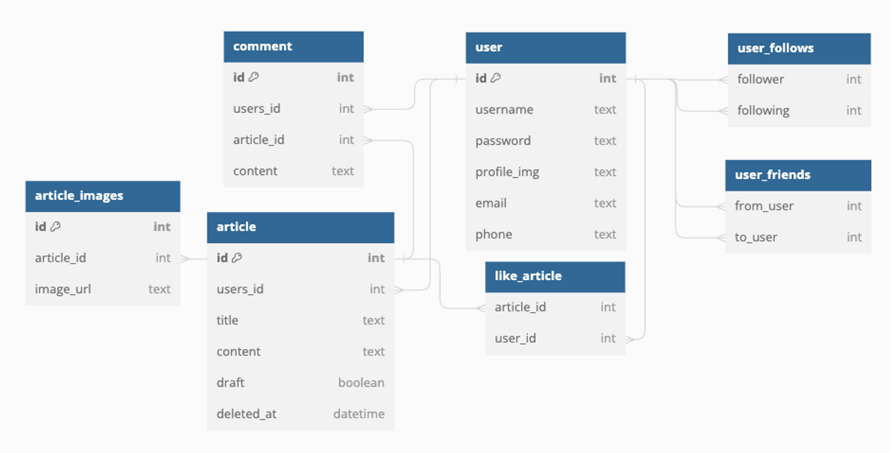

# 멋쟁이사자처럼 미션프로젝트 📮멋사SNS📮

## ⌛️ 개발 기간

2023.08.03 ~ 2023.08.08

## ⚙️ 사용 기술 및 개발 환경

- `Java17`
- `Spring Boot 3.1.1`
- `IntelliJ`
- `Sqlite`
- `Spring Security`

## 📌 API 명세서

 ✨ 작동 확인 전 세팅 ✨

1️⃣ 아래 PostMan Document에서 "Run in PostMan"을 누르고 Import할 Workspace를 선택한다.
  

2️⃣ 우측 위 Environments를 선택하는 부분에서 "Market Environment"를 선택한다.
  

3️⃣ Request마다 토큰 설정을 해준다.  
▶️ 작동 시, user1 / user2 / user3 입력하는 Request에는 토큰 설정을 아래와 같이 한다.
  

[PostMan Document](https://documenter.getpostman.com/view/22906513/2s9XxzvYvX)

[PostMan Json](https://github.com/likelion-backend-5th/Project_2_KimSoyoung/blob/main/SNS.postman_collection.json)

## ✅ 주요 기능

### User

+ 사용자는 회원 가입을 진행할 수 있는 '회원가입 기능'이 필요하다.
    + 반드시 포함되어야 할 내용 : 아이디, 비밀번호
    + 부수적으로 이메일, 전화번호 기입
+ 사용자는 아이디, 비밀번호를 통해 접속할 수 있는 '로그인 기능'이 필요하다.
    + 로그인에 성공하면 인증이 필요한 서비스에 접근 가능
    + 인증 방식은 JWT 를 이용한 토큰 인증 방식
+ 사용자는 프로필 사진을 업로드 할 수 있다.
    + 인증된 사용자만 가능
+ 사용자는 다른 사용자를 팔로우 할 수 있다.
    + 팔로우는 일방적인 관계
    + 인증된 사용자만 가능
+ 사용자는 팔로우한 사용자의 팔로우를 해제할 수 있다.
    + 인증된 사용자만 가능
+ 사용자는 다른 사용자와 친구관계를 맺을 수 있다.
    + 친구 관계는 양방적인 관계
    + A 사용자는 B 사용자에게 친구 요청을 보낸다.
    + B 사용자는 자신의 친구 요청 목록을 확인할 수 있다.
    + B 사용자는 친구 요청을 수락 혹은 거절할 수 있다.
    + 인증된 사용자만 가능

### Article

+ 사용자가 피드를 작성하기 위해 '피드 작성 기능'이 필요하다.
    + 반드시 포함되어야 할 내용 : 제목, 내용
    + 복수의 이미지 첨부 가능
    + 인증된 사용자만 사용
+ 사용자가 피드를 조회하기 위해 '피드 조회 기능'이 필요하다.
    + 사용자의 정보가 제공되어야 함
    + 목록 단위 조회
        + 아이디, 제목, 대표 이미지에 관한 정보가 포함
        + 대표 이미지가 없다면 지정된 기본 이미지로 지정
        + 누구든지 열람 가능
    + 단일 조회
        + 아이디, 제목, 등록된 모든 이미지, 댓글 목록, 좋아요 숫자가 포함
        + 인증된 사용자만 사용
+ 사용자가 피드를 수정하기 위해 '피드 수정 기능'이 필요하다.
    + 이미지는 삭제 및 추가만 가능
        + 삭제될 경우 서버에서도 삭제
    + 인증된 사용자만 사용
+ 사용자가 피드를 삭제하기 위해 '피드 삭제 기능'이 필요하다.
    + 실제 데이터베이스에서 삭제가 아닌 삭제되었다는 표시만 남김
    + 인증된 사용자만 사용
+ 사용자가 다른 사용자의 피드에 '좋아요'를 할 수 있다.
    + 자신의 피드는 좋아요 할 수 없음
    + 좋아요 요청이 이미 되었다면 좋아요는 취소됨

### Comment

+ 사용자가 피드에 대한 의견을 제시하는 문구를 작성하기 위해 '댓글 작성 기능'이 필요하다.
    + 반드시 포함되어야 할 내용 : 댓글내용
    + 인증된 사용자만 사용
+ 사용자가 피드에 대한 의견을 제시하는 문구를 조회하기 위해 '댓글 조회 기능'이 필요하다.
    + 목록 조회 시 댓글 조회 가능
    + 인증된 사용자만 사용
+ 사용자가 피드에 대한 의견을 제시하는 문구를 수정하기 위해 '댓글 수정 기능'이 필요하다.
    + 인증된 사용자만 사용
+ 사용자가 피드에 대한 의견을 제시하는 문구를 삭제하기 위해 '댓글 삭제 기능'이 필요하다.
    + 실제 데이터베이스에서 삭제가 아닌 삭제되었다는 표시만 남김
    + 인증된 사용자만 사용

## 🪧 DB ERD

## 🤗 코드 리뷰를 위한 Team Repository

<https://github.com/likelion-backend-5th/PeerReview_5Team>
